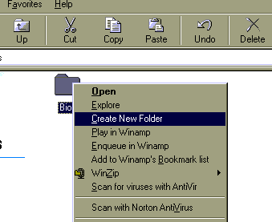

<div align="center">

## Create New Folder from the popup menu of "tpye:File Folders"


</div>

### Description

tired of waiting to popup the new>New Folder heres a little program... this makes yer life easier
 
### More Info
 


<span>             |<span>
---                |---
**Submitted On**   |
**By**             |[BIOS \[ze0slot\]](https://github.com/Planet-Source-Code/PSCIndex/blob/master/ByAuthor/bios-ze0slot.md)
**Level**          |Advanced
**User Rating**    |5.0 (10 globes from 2 users)
**Compatibility**  |VB 5\.0, VB 6\.0
**Category**       |[Files/ File Controls/ Input/ Output](https://github.com/Planet-Source-Code/PSCIndex/blob/master/ByCategory/files-file-controls-input-output__1-3.md)
**World**          |[Visual Basic](https://github.com/Planet-Source-Code/PSCIndex/blob/master/ByWorld/visual-basic.md)
**Archive File**   |[](https://github.com/Planet-Source-Code/bios-ze0slot-create-new-folder-from-the-popup-menu-of-tpye-file-folders__1-34334/archive/master.zip)


### Source Code

```
type the following code on your editor then save it to <filename>.vbs
dim shl <enter>
set shl = CreateObject("WScript.Shell") <enter>
shl.RegWrite "HKCR\Folder\Shell\Create New Folder\","Create &New Folder" <enter>
shl.RegWrite "HKCR\Folder\Shell\Create New Folder\Command\","C:\COMMAND.COM /C MD New_Folder"<enter>
ladies & Gents! their, hope this is usefull to yah!
BY: BIOS frm Villasis Pangasinan
```

